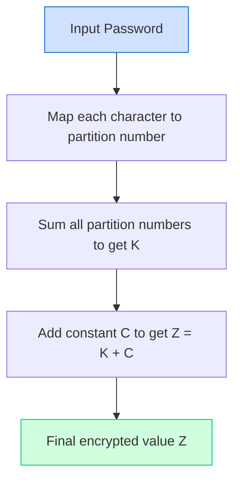
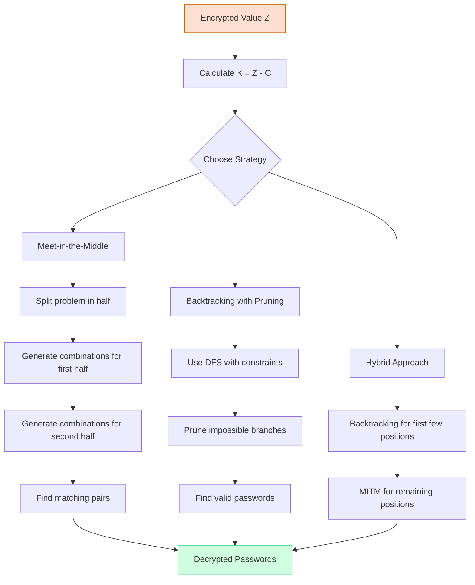

# Infinity Trials: A Cryptographic Journey Through Partition Numbers


## Quick Navigation
- [Overview](#overview)
- [Version 1 (Original Python)](#version-1-original-python)
- [Version 2 (Advanced C++ Implementation)](#version-2-a-leap-forward)
- [Mathematical Background](#mathematical-background)
- [Algorithm Mechanics](#algorithm-mechanics)
- [Setup Instructions](#setup-instructions)

## Overview

**Infinity Trials** is an encryption system based on mathematical partition numbers. It transforms passwords into large numbers that are difficult to reverse without knowing the encryption method and lookup tables.

## Version 1 (Original Python)

The original implementation was created as an undergraduate hobby project:

**How it works:**
1. Each character in your password is mapped to a unique partition number
2. These partition numbers are added together to form value K
3. A large constant C is added to K to produce the final encrypted value Z

**Limitations:**
- One-way encryption (no built-in decryption method)
- Performance issues with large partition calculations
- Basic implementation without optimizations

**Setup:**
```bash
# Clone the repository
git clone https://github.com/AvanAvi/Infinite_Trials.git

# Install requirements
pip install pandas openpyxl

# Run the encryption tool
python main_encryption_py.py
```

## Version 2: A Leap Forward

I'm excited to announce that I've started working on **Version 2** of the **Infinity Trials** algorithm. This improved version will be built gradually using **C++**, a more system-centric language, to achieve greater optimization and performance. The previous version, which my friend Pushkar Pohekar and I worked on years ago, was a hobby project sparked by curiosity and intuition. While it laid a solid foundation, this new iteration is a deliberate step toward a more refined and efficient approach.

**Why C++?**
* **Optimization**: C++ offers fine-grained control over system resources, which is critical for the compute-intensive calculations involved in partition number-based cryptography.
* **Efficiency**: Moving to C++ allows me to implement more optimized algorithms and data structures, reducing computational overhead and improving scalability.

**Exploring Decryption**
For the first time, I'm exploring a **decryption mechanism** for the algorithm. This is a significant leap forward, adding practical utility and complexity to the project. While the decryption process remains resource-intensive, the progress made here marks a meaningful advancement in making the algorithm more versatile and complete.

**Development Approach**
* **Gradual Build**: Version 2 will evolve iteratively, with regular updates and refinements as I progress.
* **Community Input**: I invite contributions and feedback from the community to help shape this new version.

**Requirements:**
- C++17 compatible compiler
- GMP library for arbitrary precision arithmetic
- CMake for build management

## Mathematical Background

### Partition Numbers: The Foundation

In number theory, a **partition** of a positive integer n is a way of writing n as a sum of positive integers. The order of the summands doesn't matter, so different permutations of the same summands are counted as one partition.

**Formal Definition:**
The partition function p(n) counts the number of possible partitions of n.

**Examples:**
- p(4) = 5, because 4 can be written as:
  - 4
  - 3+1
  - 2+2
  - 2+1+1
  - 1+1+1+1
- p(5) = 7, because 5 can be written as:
  - 5
  - 4+1
  - 3+2
  - 3+1+1
  - 2+2+1
  - 2+1+1+1
  - 1+1+1+1+1

### Calculating Partition Numbers

Partition numbers grow rapidly and don't have a simple closed formula. They can be calculated using:

**Recurrence Relation (Euler's Pentagonal Number Theorem):**
```
p(n) = p(n-1) + p(n-2) - p(n-5) - p(n-7) + p(n-12) + p(n-15) - ...
```

**Dynamic Programming Approach:**
For efficient calculation, we use a dynamic programming approach:
```
p(0) = 1
p(n) = Σ (-1)^(k-1) * p(n - k(3k-1)/2) + (-1)^(k-1) * p(n - k(3k+1)/2)
```
where the sum is over all integers k (both positive and negative).

**Asymptotic Growth:**
The asymptotic behavior of p(n) was derived by Hardy and Ramanujan:
```
p(n) ~ (1 / (4n√3)) * e^(π√(2n/3))
```

This exponential growth is key to the cryptographic strength of our algorithm.

## Algorithm Mechanics

### Encryption Process



1. **Character Mapping**: Each character in the password is assigned a unique partition number from a lookup table.
2. **Summation**: These partition numbers are added together to produce value K.
3. **Addition of Constant**: A large constant C (426609638937) is added to K to produce the final encrypted value Z.

### Decryption Strategies in Version 2

In Version 2, we've introduced three strategies to approach the decryption problem:



1. **Meet-in-the-Middle**: Reduces O(c^n) complexity to O(c^(n/2)) by splitting the problem
2. **Backtracking with Pruning**: Uses depth-first search with aggressive constraint-based pruning
3. **Hybrid Approach**: Combines backtracking for the first few positions with MITM for the rest

Each strategy offers different trade-offs between memory usage, CPU time, and effectiveness for different password lengths.

## Setup Instructions

### Version 1 (Python)
```bash
# Requirements
Python 3.x
pandas, openpyxl libraries

# Setup
git clone https://github.com/AvanAvi/Infinite_Trials.git
cd Infinite_Trials
python main_encryption_py.py
```

### Version 2 (C++)
```bash
# Requirements
C++17 compiler
GMP library
CMake

# On macOS
brew install gmp cmake

# Setup
git clone https://github.com/AvanAvi/Infinite_Trials.git
cd Infinite_Trials/v2
mkdir build && cd build
cmake ..
make
```

## Acknowledgements

- **Original Collaborators**: Pushkar Pohekar and myself during our undergraduate days
- **Mathematical Inspiration**: S. Ramanujan's work on partition numbers
- **Version 2 Development**: Started in 2025 as an extension of the original concept

---

*This project combines cryptography, number theory, and computer science to explore partition numbers as a security mechanism. While the original was a curious exploration, Version 2 aims to provide a more comprehensive analysis of the algorithm's potential.*
