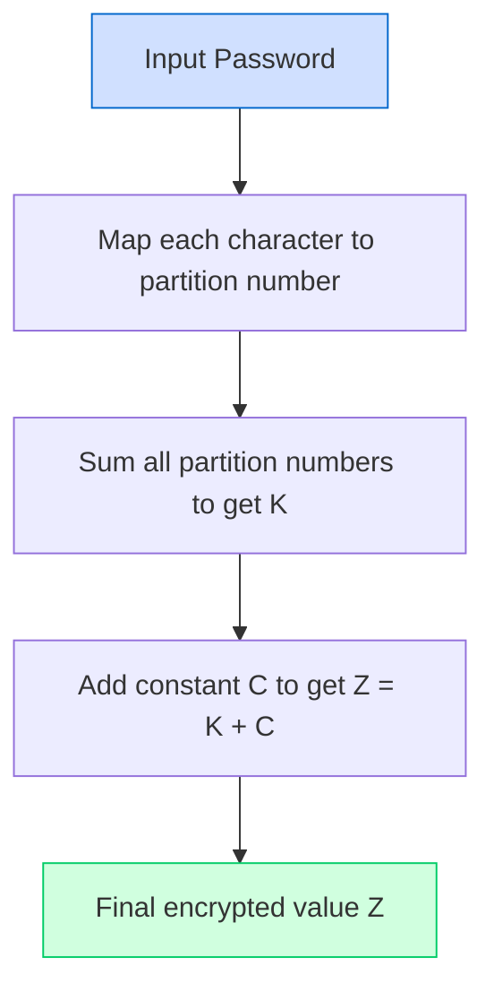
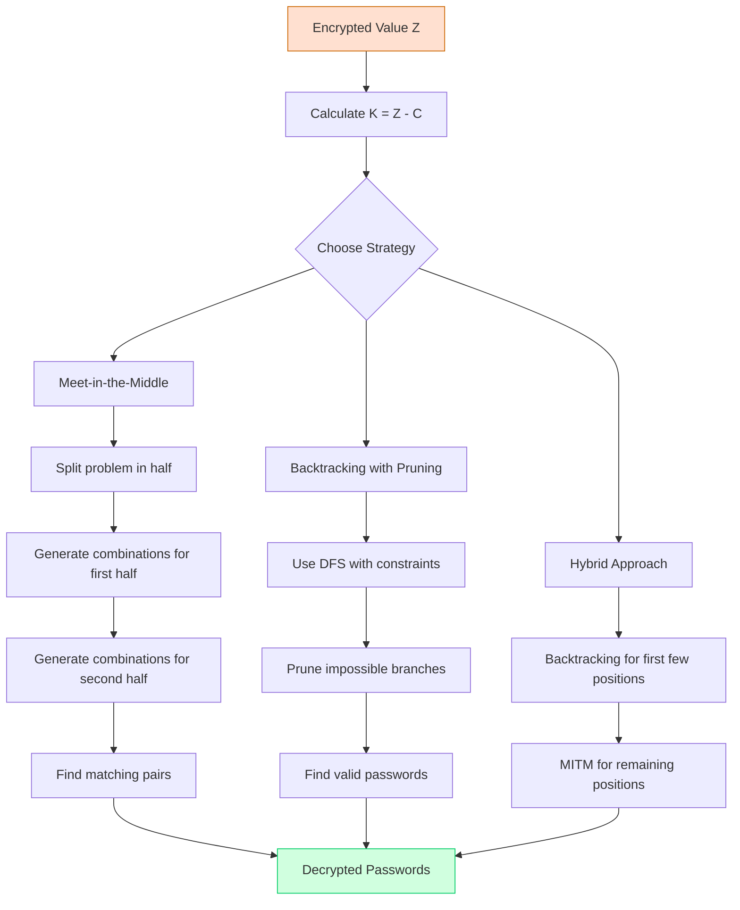

# Infinity Trials: A Cryptographic Journey Through Partition Numbers


## Quick Navigation
- [Overview](#overview)
- [Version 1 (Original Python)](#version-1-original-python)
- [Version 2 (Advanced C++ Implementation)](#version-2-a-leap-forward)
- [Version 3 (Keyed, Reversible Encryption)](#version-3-keyed-reversible-encryption)
- [Mathematical Background](#mathematical-background)
- [Algorithm Mechanics](#algorithm-mechanics)
- [Setup Instructions](#setup-instructions)

## Overview

**Infinity Trials** is a hobby project exploring integer partition numbers as the basis for a password encoding scheme, not a cryptographically secure system. Passwords are mapped to partition numbers, summed, and offset by a public constant to produce an encrypted value Z. Both the character-to-partition lookup table and the constant are checked into this public repository, so there is no secret to protect in the first place - and even with a secret table, the sum discards character order and collides heavily: see [docs/ANALYSIS.md](docs/ANALYSIS.md) for measured collision counts (a realistic 10-character password shares its Z with over 166,000 other, unrelated passwords). Treat this as a mathematical curiosity, not something to protect real credentials with.

## Version 1 (Original Python)

The original implementation was created as an undergraduate hobby project:

**How it works:**
1. Each character in your password is mapped to a unique partition number
2. These partition numbers are added together to form value K
3. A large constant C is added to K to produce the final encrypted value Z

**Limitations:**
- One-way encryption (no built-in decryption method)
- Performance issues with large partition calculations
- Basic implementation without optimizations

**Setup:**
```bash
# Clone the repository
git clone https://github.com/AvanAvi/Infinite_Trials.git

# Install requirements
pip install pandas openpyxl

# Run the encryption tool
python main_encryption_py.py
```

## Version 2: A Leap Forward

I'm excited to announce that I've started working on **Version 2** of the **Infinity Trials** algorithm. This improved version will be built gradually using **C++**, a more system-centric language, to achieve greater optimization and performance. The previous version, which my friend Pushkar Pohekar and I worked on years ago, was a hobby project sparked by curiosity and intuition. While it laid a solid foundation, this new iteration is a deliberate step toward a more refined and efficient approach.

**Why C++?**
* **Optimization**: C++ offers fine-grained control over system resources, which is critical for the compute-intensive calculations involved in partition number-based cryptography.
* **Efficiency**: Moving to C++ allows me to implement more optimized algorithms and data structures, reducing computational overhead and improving scalability.

**Exploring Decryption**
For the first time, I'm exploring a **decryption mechanism** for the algorithm. This is a significant leap forward, adding practical utility and complexity to the project. While the decryption process remains resource-intensive, the progress made here marks a meaningful advancement in making the algorithm more versatile and complete.

**Development Approach**
* **Gradual Build**: Version 2 will evolve iteratively, with regular updates and refinements as I progress.
* **Community Input**: I invite contributions and feedback from the community to help shape this new version.

**Requirements:**
- C++17 compatible compiler
- GMP library for arbitrary precision arithmetic
- CMake for build management

## Version 3: Keyed, Reversible Encryption

Version 3 is a different construction from V1/V2, not a fix to them - see
[docs/ANALYSIS.md](docs/ANALYSIS.md) for why V1/V2's approach can't be
patched into something secure. It still uses partition numbers, but as
the *domain* a keyed permutation operates over, not as the source of any
difficulty:

1. **Encode**: the password becomes an integer via fixed-alphabet base-62 encoding (`Version3/encoding.py`), with its length stored alongside - not reconstructed by padding, which would be ambiguous (`"a"` and `"aa"` both encode to value 0).
2. **Permute**: a keyed balanced Feistel network (10+ rounds, HMAC-SHA256 round function, cycle walking to stay in range - `Version3/feistel.py`) turns that integer into a different one in the same range, using a 256-bit key.
3. **Unrank**: the permuted integer is unranked into a partition of some N (`Version3/partition_rank.py`, a bijection between integers and partitions of N) - that partition, serialized as `N:length:part1+part2+...`, is the ciphertext.

Decryption reverses every step exactly, recovering the original password
bit-for-bit - unlike V1/V2, where decryption returns *a* valid password
sharing the same encrypted value, not necessarily *the* one that was
encrypted.

**Where the security comes from:** the 256-bit key and HMAC-SHA256, not
the partition math - see [docs/THREAT_MODEL.md](docs/THREAT_MODEL.md) for
what that does and doesn't cover (known limitations: encryption is
currently deterministic, the Feistel construction is custom and
unaudited, and ciphertext length leaks roughly the password length).
[docs/ROADMAP.md](docs/ROADMAP.md) covers what closes those gaps next,
plus a post-quantum review.

### Usage

```bash
cd Version3
python3 -m venv .venv && .venv/bin/pip install -r requirements.txt

# Generate a random 256-bit key
.venv/bin/python3 cli.py keygen
# key: <64 hex characters>

# Or derive one from a passphrase (Argon2id, ~0.5-1s) - save the printed salt
.venv/bin/python3 cli.py keygen --passphrase

# Encrypt / decrypt with a hex key
.venv/bin/python3 cli.py encrypt --key <hex> "MyPassword123"
.venv/bin/python3 cli.py decrypt --key <hex> "<ciphertext>"

# Or with a passphrase (decrypt requires the same --salt encrypt printed)
.venv/bin/python3 cli.py encrypt --passphrase "MyPassword123"
.venv/bin/python3 cli.py decrypt --passphrase --salt <hex> "<ciphertext>"

# Run the tests (54 tests, ~2 minutes - dominated by one-time partition
# table builds for large password lengths, cached after first use)
.venv/bin/python3 -m unittest discover -p "test_*.py"
```

## Mathematical Background

### Partition Numbers: The Foundation

In number theory, a **partition** of a positive integer n is a way of writing n as a sum of positive integers. The order of the summands doesn't matter, so different permutations of the same summands are counted as one partition.

**Formal Definition:**
The partition function p(n) counts the number of possible partitions of n.

**Examples:**
- p(4) = 5, because 4 can be written as:
  - 4
  - 3+1
  - 2+2
  - 2+1+1
  - 1+1+1+1
- p(5) = 7, because 5 can be written as:
  - 5
  - 4+1
  - 3+2
  - 3+1+1
  - 2+2+1
  - 2+1+1+1
  - 1+1+1+1+1

### Calculating Partition Numbers

Partition numbers grow rapidly and don't have a simple closed formula. They can be calculated using:

**Recurrence Relation (Euler's Pentagonal Number Theorem):**
```
p(n) = p(n-1) + p(n-2) - p(n-5) - p(n-7) + p(n-12) + p(n-15) - ...
```

**Dynamic Programming Approach:**
For efficient calculation, we use a dynamic programming approach:
```
p(0) = 1
p(n) = Σ (-1)^(k-1) * p(n - k(3k-1)/2) + (-1)^(k-1) * p(n - k(3k+1)/2)
```
where the sum is over all integers k (both positive and negative).

**Asymptotic Growth:**
The asymptotic behavior of p(n) was derived by Hardy and Ramanujan:
```
p(n) ~ (1 / (4n√3)) * e^(π√(2n/3))
```

This exponential growth means large partition values are expensive to search exhaustively as *ordered strings*, but that has nothing to do with why the scheme resists exact decryption. The real reason is structural, not computational: summation is order-blind and many-to-one (see [docs/ANALYSIS.md](docs/ANALYSIS.md)), so no amount of compute recovers *the* password - only one of many equally valid candidates that produce the same Z.

## Algorithm Mechanics

### Encryption Process


```mermaid
flowchart TD
    A[Input Password] --> B[Map each character to partition number]
    B --> C[Sum all partition numbers to get K]
    C --> D[Add constant C to get Z = K + C]
    D --> E[Final encrypted value Z]
    
    style A fill:#d0e0ff,stroke:#0066cc
    style E fill:#d0ffdf,stroke:#00cc66
```

1. **Character Mapping**: Each character in the password is assigned a unique partition number from a lookup table.
2. **Summation**: These partition numbers are added together to produce value K.
3. **Addition of Constant**: A large constant C (426609638937) is added to K to produce the final encrypted value Z.

### Decryption Strategies in Version 2

In Version 2, we've introduced three strategies to approach the decryption problem:


```mermaid
flowchart TD
    A[Encrypted Value Z] --> B[Calculate K = Z - C]
    B --> C{Choose Strategy}
    C --> D[Meet-in-the-Middle]
    C --> E[Backtracking with Pruning]
    C --> F[Hybrid Approach]
    
    D --> G[Split problem in half]
    G --> H[Generate combinations for first half]
    H --> I[Generate combinations for second half]
    I --> J[Find matching pairs]
    
    E --> K[Use DFS with constraints]
    K --> L[Prune impossible branches]
    L --> M[Find valid passwords]
    
    F --> N[Backtracking for first few positions]
    N --> O[MITM for remaining positions]
    
    J --> P[Decrypted Passwords]
    M --> P
    O --> P
    
    style A fill:#ffe0d0,stroke:#cc6600
    style P fill:#d0ffdf,stroke:#00cc66
```

1. **Meet-in-the-Middle**: Splits each candidate length in half, enumerates character multisets per half, and merges matches
2. **Backtracking with Pruning**: Enumerates character multisets via depth-first search with aggressive constraint-based pruning
3. **Hybrid Approach**: Planned - combines backtracking for the first few positions with MITM for the rest; not yet implemented

Both implemented strategies enumerate *multisets* of characters, not ordered strings - the sum can't distinguish character order, so trying every ordering would just rediscover the same few results repeatedly. Every result re-encrypts to the target Z, but as [docs/ANALYSIS.md](docs/ANALYSIS.md) shows, that target Z is shared by very many result multisets - decryption returns *a* valid password, not necessarily *the* one that was encrypted.

## Setup Instructions

### Version 1 (Python)
```bash
# Requirements
Python 3.x
pandas, openpyxl libraries

# Setup
git clone https://github.com/AvanAvi/Infinite_Trials.git
cd Infinite_Trials
python main_encryption_py.py
```

### Version 2 (C++)
```bash
# Requirements
C++17 compiler
GMP library
CMake

# On macOS
brew install gmp cmake

# Setup
git clone https://github.com/AvanAvi/Infinite_Trials.git
cd Infinite_Trials/Version2
mkdir build && cd build
cmake ..
make

# Run tests
ctest --output-on-failure
```

### Version 3 (Python)
```bash
# Requirements
Python 3.9+
argon2-cffi (installed into a venv below - Homebrew's externally-managed
Python blocks global pip installs, and a venv is the right call anyway)

# Setup
git clone https://github.com/AvanAvi/Infinite_Trials.git
cd Infinite_Trials/Version3
python3 -m venv .venv
.venv/bin/pip install -r requirements.txt

# Run tests
.venv/bin/python3 -m unittest discover -p "test_*.py"
```

## Acknowledgements

- **Original Collaborators**: Pushkar Pohekar and myself during our undergraduate days
- **Mathematical Inspiration**: S. Ramanujan's work on partition numbers
- **Version 2 Development**: Started in 2025 as an extension of the original concept
- **Version 3 Development**: A properly keyed, reversible construction, built once V1/V2's approach was shown not to be fixable (see docs/ANALYSIS.md)

---

*This project combines number theory and computer science to explore partition numbers as the basis for an encoding scheme. V1 and V2 are not secure, despite earlier versions of this README's claims - see [docs/ANALYSIS.md](docs/ANALYSIS.md) for why exact decryption isn't achievable there. V3 is a properly keyed, reversible design built on the same mathematics; see [docs/THREAT_MODEL.md](docs/THREAT_MODEL.md) for what its security does and doesn't rest on, and [docs/ROADMAP.md](docs/ROADMAP.md) for what's next.*
